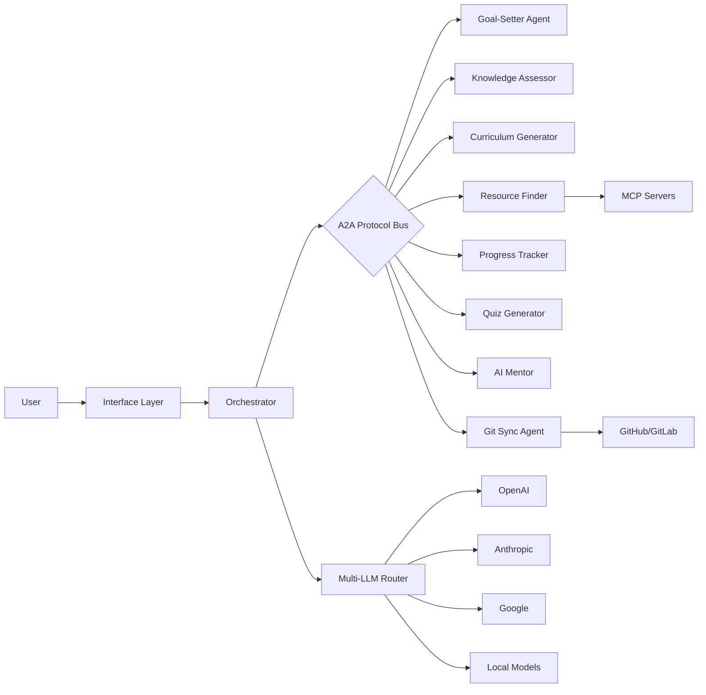
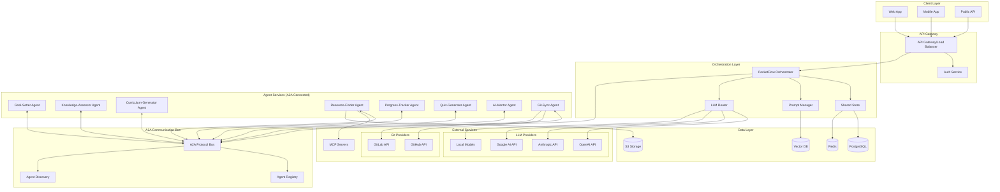
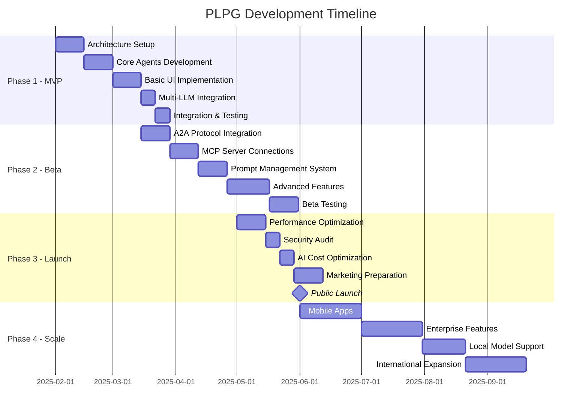

# Product Requirements Document (PRD)

## Personalized Learning-Path Generator (PER-LERP)

**Version:** 1.1
 **Date:** January 2025
 **Status:** Final
 **Authors:** Khushil Dep & Generative AI

------

## Table of Contents

1. [Executive Summary](https://claude.ai/chat/eb54e3f7-6d09-4084-b183-bc127d9a16f7#1-executive-summary)
2. [Problem Statement](https://claude.ai/chat/eb54e3f7-6d09-4084-b183-bc127d9a16f7#2-problem-statement)
3. [Solution Overview](https://claude.ai/chat/eb54e3f7-6d09-4084-b183-bc127d9a16f7#3-solution-overview)
4. [User Personas](https://claude.ai/chat/eb54e3f7-6d09-4084-b183-bc127d9a16f7#4-user-personas)
5. [User Stories and Use Cases](https://claude.ai/chat/eb54e3f7-6d09-4084-b183-bc127d9a16f7#5-user-stories-and-use-cases)
6. [Functional Requirements](https://claude.ai/chat/eb54e3f7-6d09-4084-b183-bc127d9a16f7#6-functional-requirements)
7. [Technical Requirements](https://claude.ai/chat/eb54e3f7-6d09-4084-b183-bc127d9a16f7#7-technical-requirements)
8. [System Architecture](https://claude.ai/chat/eb54e3f7-6d09-4084-b183-bc127d9a16f7#8-system-architecture)
9. [Data Model](https://claude.ai/chat/eb54e3f7-6d09-4084-b183-bc127d9a16f7#9-data-model)
10. [API Specifications](https://claude.ai/chat/eb54e3f7-6d09-4084-b183-bc127d9a16f7#10-api-specifications)
11. [UI/UX Requirements](https://claude.ai/chat/eb54e3f7-6d09-4084-b183-bc127d9a16f7#11-ui-ux-requirements)
12. [Success Metrics](https://claude.ai/chat/eb54e3f7-6d09-4084-b183-bc127d9a16f7#12-success-metrics)
13. [Security and Privacy](https://claude.ai/chat/eb54e3f7-6d09-4084-b183-bc127d9a16f7#13-security-and-privacy)
14. [Timeline and Milestones](https://claude.ai/chat/eb54e3f7-6d09-4084-b183-bc127d9a16f7#14-timeline-and-milestones)
15. [Risks and Mitigations](https://claude.ai/chat/eb54e3f7-6d09-4084-b183-bc127d9a16f7#15-risks-and-mitigations)
16. [Future Enhancements](https://claude.ai/chat/eb54e3f7-6d09-4084-b183-bc127d9a16f7#16-future-enhancements)
17. [Appendices](https://claude.ai/chat/eb54e3f7-6d09-4084-b183-bc127d9a16f7#17-appendices)

------

## 1. Executive Summary

The Personalized Learning-Path Generator (PER-LERP) is an AI-powered education platform that creates individualized learning experiences by orchestrating multiple specialized AI agents. Using cutting-edge technologies including PocketFlow, Google A2A protocol, and MCP servers, PER-LERPadapts to each learner's goals, knowledge level, and learning style to deliver optimal educational outcomes.

### Key Features

- Adaptive curriculum generation based on individual assessment
- Multi-source resource curation from YouTube, GitHub, documentation sites
- Real-time progress tracking with dynamic path adjustment
- 24/7 AI mentor support
- Project-based learning milestones
- Spaced repetition and knowledge reinforcement
- Multi-LLM support with user-configurable model selection
- Dynamic prompt management with self-tuning capabilities
- **Personal Git repository integration for learning portfolio**
- **Full A2A protocol implementation for all agent communication**

### Target Market

- Career changers seeking technical skills
- Students supplementing formal education
- Professionals upskilling in their field
- Hobbyists pursuing structured learning
- Developers wanting version-controlled learning progress

### Unique Value Proposition

PER-LERP leverages a multi-agent architecture where specialized AI agents collaborate via Google's A2A protocol to create and maintain personalized learning journeys. Unlike traditional e-learning platforms with static content, PER-LERP dynamically adapts to each learner's progress, struggles, and successes in real-time. Users maintain complete ownership of their learning journey through Git repository integration, ensuring portability and long-term value.

------

## 2. Problem Statement

### Current State Problems

1. **One-size-fits-all curricula** fail to account for individual backgrounds and learning speeds
2. **Information overload** makes it difficult to find quality, sequenced learning resources
3. **Lack of personalized feedback** leads to knowledge gaps and abandoned learning attempts
4. **Static learning paths** don't adapt when learners struggle or excel
5. **Isolated learning** without mentor support increases dropout rates
6. **Vendor lock-in** with single AI providers limits flexibility and increases costs

### Market Opportunity

- Global e-learning market expected to reach $840 billion by 2030
- 67% of learners report wanting more personalized learning experiences
- 73% of employees want to learn new skills but don't know where to start
- Growing demand for AI transparency and user control over AI systems

### Competitive Landscape

- **Coursera/Udemy**: General courses, minimal personalization
- **Khan Academy**: K-12 focus, linear progression
- **Duolingo**: Language-specific, gamification-focused
- **Udacity**: Nanodegrees, expensive and rigid
- **PER-LERP Advantage**: True AI-driven personalization with multi-source curation and user control

------

## 3. Solution Overview

PER-LERP leverages a multi-agent architecture where specialized AI agents collaborate to create and maintain personalized learning journeys. **All agent-to-agent communication is handled through Google's A2A (Agent-to-Agent) protocol**, ensuring standardized, secure, and scalable interactions.



### Core Value Propositions

1. **Truly Personalized**: Every learning path is unique to the individual
2. **Adaptive**: Continuously adjusts based on progress and performance
3. **Comprehensive**: Curates from multiple high-quality sources
4. **Supportive**: 24/7 AI mentor assistance
5. **Efficient**: Optimizes learning time through smart sequencing
6. **Flexible**: User-configurable AI models and prompts
7. **Transparent**: Clear visibility into AI decisions and costs
8. **Portable**: Git integration ensures users own their learning data

### Key Differentiators

- **A2A-Powered Multi-Agent Collaboration**: All agents communicate via Google's A2A protocol
- **Multi-LLM Support**: Choose from OpenAI, Anthropic, Google, or local models
- **Dynamic Prompt Evolution**: Self-tuning prompts that improve over time
- **Privacy-First Options**: Support for local models and data residency
- **12-Factor Agent Principles**: Production-ready, scalable architecture
- **Learning Portfolio Ownership**: Personal Git repository for all learning content

------

## 4. User Personas

### Primary Persona: "Career Changer Carlos"

- **Age**: 28-35

- **Background**: Business degree, 5 years in marketing

- **Goal**: Transition to data science role

- Pain Points

  :

  - Overwhelmed by learning options
  - Limited time (1-2 hours/day)
  - Needs job-ready skills quickly
  - Concerned about AI costs

- **Success Criteria**: Land data science job within 6 months

- **AI Preferences**: Balance quality with cost, prefers cloud models

### Secondary Persona: "Upskilling Uma"

- **Age**: 25-40

- **Background**: Software developer

- **Goal**: Learn machine learning for current role

- Pain Points

  :

  - Needs to fill specific knowledge gaps
  - Wants practical, applicable skills
  - Prefers learning by doing
  - Values AI transparency

- **Success Criteria**: Apply ML in current projects

- **AI Preferences**: Highest quality models, willing to pay premium

### Tertiary Persona: "Student Sarah"

- **Age**: 18-24

- **Background**: Computer Science student

- **Goal**: Supplement university courses

- Pain Points

  :

  - University pace too slow/fast
  - Wants real-world applications
  - Needs better explanations
  - Budget-conscious

- **Success Criteria**: Improved grades and project portfolio

- **AI Preferences**: Free/low-cost options, open to local models

### Privacy-Conscious Persona: "Secure Sam"

- **Age**: 30-45

- **Background**: Enterprise developer

- **Goal**: Learn cloud architecture

- Pain Points

  :

  - Corporate data policies
  - Needs on-premise options
  - Audit trail requirements

- **Success Criteria**: Pass cloud certifications

- **AI Preferences**: Local models only, full data control

------

## 5. User Stories and Use Cases

### Epic 1: Onboarding and Assessment

**User Story 1.1**: As a new user, I want to describe my learning goals in natural language so the system understands what I want to achieve.

**Acceptance Criteria**:

- Natural language input for goals
- Clarifying questions for ambiguous goals
- Goal categorization and validation
- Timeline and commitment setting
- Model selection for conversation

**User Story 1.2**: As a learner, I want my current knowledge assessed so I don't waste time on topics I already know.

**Acceptance Criteria**:

- Adaptive assessment (gets harder/easier based on responses)
- Multiple assessment types (quiz, code challenges, concept maps)
- Skip option for confident users
- Clear knowledge gap identification
- Progress saving for interrupted assessments

**User Story 1.3**: As a privacy-conscious user, I want to choose which AI models process my data.

**Acceptance Criteria**:

- Clear model selection interface
- Cost transparency for each model
- Local model options highlighted
- Data residency information
- Easy model switching

### Epic 2: Curriculum Generation and Learning

**User Story 2.1**: As a learner, I want a personalized curriculum that fits my schedule and learning style.

**Acceptance Criteria**:

- Curriculum respects time constraints
- Mix of content types based on preferences
- Clear learning objectives for each module
- Project milestones included
- Alternative paths for different pacing

**User Story 2.2**: As a learner, I want high-quality resources curated for each topic so I learn from the best sources.

**Acceptance Criteria**:

- Resources from multiple platforms
- Quality scoring and filtering
- Variety of formats (video, text, interactive)
- Free and paid options clearly marked
- Offline availability indicators

**User Story 2.3**: As a user, I want to customize the AI's communication style to match my preferences.

**Acceptance Criteria**:

- Tone adjustment options
- Verbosity settings
- Cultural adaptation
- Technical level customization
- Save preferences per agent

### Epic 3: Progress and Support

**User Story 3.1**: As a learner, I want to track my progress and see how I'm improving over time.

**Acceptance Criteria**:

- Visual progress indicators
- Skill tree visualization
- Streak tracking and motivation
- Knowledge decay warnings
- Export progress reports

**User Story 3.2**: As a learner, I want help when I'm stuck so I don't get frustrated and quit.

**Acceptance Criteria**:

- Context-aware help suggestions
- AI mentor chat available 24/7
- Alternative resource recommendations
- Community support integration
- Escalation to human tutors (future)

### Epic 4: AI Management

**User Story 4.1**: As a budget-conscious user, I want to control my AI spending.

**Acceptance Criteria**:

- Real-time cost tracking
- Budget alerts and limits
- Model recommendations by cost
- Usage analytics
- Cost optimization suggestions

**User Story 4.2**: As an advanced user, I want to tune the AI prompts for better results.

**Acceptance Criteria**:

- View current prompts
- Edit prompt templates
- Test prompt changes
- Revert to defaults
- Share successful prompts

### Epic 5: Personal Learning Repository

**User Story 5.1**: As a learner, I want to save my learning journey to my own Git repository for ownership and portability.

**Acceptance Criteria**:

- Connect GitHub/GitLab account via OAuth
- Choose repository (existing or create new)
- Select privacy level for synced data
- Automatic progress backups
- Manual sync trigger option

**User Story 5.2**: As a developer learner, I want my code projects to be version controlled in my repository.

**Acceptance Criteria**:

- Project code automatically committed
- Meaningful commit messages
- Branch management for experiments
- Integration with CI/CD pipelines
- Code review workflow support

**User Story 5.3**: As a privacy-conscious user, I want control over what gets synced to my repository.

**Acceptance Criteria**:

- Granular sync settings
- PII exclusion options
- AI interaction privacy controls
- Encryption for sensitive data
- Clear data ownership model

------

## 6. Functional Requirements

### 6.1 Goal Setting Module

| Requirement ID | Description                                  | Priority | Agent       |
| -------------- | -------------------------------------------- | -------- | ----------- |
| F-GS-001       | Natural language goal input with NLP parsing | P0       | Goal-Setter |
| F-GS-002       | Goal clarification dialogue system           | P0       | Goal-Setter |
| F-GS-003       | Learning style preference capture            | P1       | Goal-Setter |
| F-GS-004       | Time commitment and schedule setting         | P0       | Goal-Setter |
| F-GS-005       | Prerequisite identification                  | P1       | Goal-Setter |
| F-GS-006       | Model selection for goal conversation        | P0       | Goal-Setter |

### 6.2 Knowledge Assessment Module

| Requirement ID | Description                    | Priority | Agent              |
| -------------- | ------------------------------ | -------- | ------------------ |
| F-KA-001       | Adaptive questioning algorithm | P0       | Knowledge-Assessor |
| F-KA-002       | Multiple assessment formats    | P0       | Knowledge-Assessor |
| F-KA-003       | Knowledge graph generation     | P1       | Knowledge-Assessor |
| F-KA-004       | Confidence level tracking      | P2       | Knowledge-Assessor |
| F-KA-005       | Assessment history storage     | P1       | Knowledge-Assessor |
| F-KA-006       | Configurable assessment depth  | P1       | Knowledge-Assessor |

### 6.3 Curriculum Generation Module

| Requirement ID | Description                       | Priority | Agent                |
| -------------- | --------------------------------- | -------- | -------------------- |
| F-CG-001       | Personalized path generation      | P0       | Curriculum-Generator |
| F-CG-002       | Prerequisite sequencing           | P0       | Curriculum-Generator |
| F-CG-003       | Difficulty curve optimization     | P1       | Curriculum-Generator |
| F-CG-004       | Project milestone integration     | P0       | Curriculum-Generator |
| F-CG-005       | Alternative path generation       | P2       | Curriculum-Generator |
| F-CG-006       | Multi-model curriculum comparison | P1       | Curriculum-Generator |

### 6.4 Resource Curation Module

| Requirement ID | Description                    | Priority | Agent           |
| -------------- | ------------------------------ | -------- | --------------- |
| F-RF-001       | Multi-platform resource search | P0       | Resource-Finder |
| F-RF-002       | Quality scoring algorithm      | P0       | Resource-Finder |
| F-RF-003       | Content type filtering         | P1       | Resource-Finder |
| F-RF-004       | Freshness checking             | P1       | Resource-Finder |
| F-RF-005       | License and cost tracking      | P1       | Resource-Finder |
| F-RF-006       | Offline content identification | P2       | Resource-Finder |

### 6.5 Progress Tracking Module

| Requirement ID | Description                     | Priority | Agent            |
| -------------- | ------------------------------- | -------- | ---------------- |
| F-PT-001       | Learning activity logging       | P0       | Progress-Tracker |
| F-PT-002       | Skill progression visualization | P0       | Progress-Tracker |
| F-PT-003       | Time tracking and analytics     | P1       | Progress-Tracker |
| F-PT-004       | Knowledge retention monitoring  | P1       | Progress-Tracker |
| F-PT-005       | Achievement and badge system    | P2       | Progress-Tracker |
| F-PT-006       | Progress export functionality   | P1       | Progress-Tracker |

### 6.6 Assessment and Reinforcement Module

| Requirement ID | Description                    | Priority | Agent          |
| -------------- | ------------------------------ | -------- | -------------- |
| F-QG-001       | Dynamic quiz generation        | P0       | Quiz-Generator |
| F-QG-002       | Spaced repetition scheduling   | P0       | Quiz-Generator |
| F-QG-003       | Project rubric generation      | P1       | Quiz-Generator |
| F-QG-004       | Peer review facilitation       | P2       | Quiz-Generator |
| F-QG-005       | Certification preparation      | P2       | Quiz-Generator |
| F-QG-006       | Adaptive difficulty adjustment | P1       | Quiz-Generator |

### 6.7 AI Mentor Module

| Requirement ID | Description                       | Priority | Agent     |
| -------------- | --------------------------------- | -------- | --------- |
| F-AM-001       | Context-aware Q&A                 | P0       | AI-Mentor |
| F-AM-002       | Code debugging assistance         | P0       | AI-Mentor |
| F-AM-003       | Concept explanation generation    | P0       | AI-Mentor |
| F-AM-004       | Learning strategy recommendations | P1       | AI-Mentor |
| F-AM-005       | Motivational support              | P2       | AI-Mentor |
| F-AM-006       | Multi-modal explanations          | P1       | AI-Mentor |

### 6.8 Personal Learning Repository

| Requirement ID | Description                            | Priority | Component        |
| -------------- | -------------------------------------- | -------- | ---------------- |
| F-PLR-001      | GitHub repository integration          | P0       | Git Sync Service |
| F-PLR-002      | GitLab repository integration          | P0       | Git Sync Service |
| F-PLR-003      | OAuth authentication for Git providers | P0       | Auth Service     |
| F-PLR-004      | Automatic progress syncing             | P0       | Git Sync Service |
| F-PLR-005      | Learning content versioning            | P1       | Git Sync Service |
| F-PLR-006      | Offline-first sync strategy            | P1       | Git Sync Service |
| F-PLR-007      | Custom repository structure templates  | P1       | Git Sync Service |
| F-PLR-008      | Private/public repository support      | P0       | Git Sync Service |

### 6.9 AI Configuration Module

| Requirement ID | Description               | Priority | Component      |
| -------------- | ------------------------- | -------- | -------------- |
| F-AC-001       | Per-agent model selection | P0       | LLM Router     |
| F-AC-002       | Cost tracking and budgets | P0       | LLM Router     |
| F-AC-003       | Local model integration   | P0       | LLM Router     |
| F-AC-004       | Prompt customization UI   | P1       | Prompt Manager |
| F-AC-005       | A/B testing framework     | P1       | Prompt Manager |
| F-AC-006       | Performance analytics     | P1       | Analytics      |

------

## 7. Technical Requirements

### 7.1 System Architecture

```yaml
Architecture:
  Frontend:
    - React/Next.js web application
    - React Native mobile apps
    - WebSocket for real-time updates
  
  Backend:
    - Node.js/TypeScript services
    - PocketFlow orchestration engine
    - A2A protocol implementation
    - MCP server integrations
    - Multi-LLM router
  
  Infrastructure:
    - Kubernetes deployment
    - PostgreSQL for user data
    - Redis for session management
    - S3 for content storage
    - CloudFront CDN
```

### 7.2 Agent Framework Requirements

| Component           | Requirement              | Implementation                          |
| ------------------- | ------------------------ | --------------------------------------- |
| PocketFlow          | Orchestration engine     | v1.0+ with async support                |
| Google A2A          | Agent communication      | Full protocol compliance                |
| MCP Servers         | External tool access     | YouTube, GitHub, Documentation APIs     |
| LLM Integration     | Multi-provider support   | OpenAI, Anthropic, Google, Ollama, vLLM |
| Model Selection     | Dynamic routing          | Cost, quality, speed optimization       |
| Local Model Support | Privacy-first option     | Ollama/vLLM integration                 |
| Prompt Management   | Version control & tuning | Git-like versioning with A/B testing    |

### 7.3 Performance Requirements

- **Response Time**: < 2s for agent responses
- **Throughput**: 10,000 concurrent users
- **Availability**: 99.9% uptime SLA
- **Scalability**: Horizontal scaling for agents
- **Data Processing**: Real-time progress updates
- **Model Switching**: < 100ms overhead
- **Prompt Compilation**: < 50ms

### 7.4 Integration Requirements

```typescript
interface ExternalIntegrations {
  contentProviders: {
    youtube: YouTubeAPI;
    github: GitHubAPI;
    coursera: CourseraAPI;
    udemy: UdemyAPI;
  };
  
  assessmentTools: {
    codewars: CodewarsAPI;
    hackerrank: HackerRankAPI;
    leetcode: LeetCodeAPI;
  };
  
  llmProviders: {
    openai: OpenAIAPI;
    anthropic: AnthropicAPI;
    google: GoogleAIAPI;
    ollama: OllamaAPI;
    vllm: VLLMAPI;
  };
  
  analyticsServices: {
    mixpanel: MixpanelSDK;
    amplitude: AmplitudeSDK;
  };
}
```

### 7.5 Multi-LLM Architecture and Configuration

#### 7.5.1 LLM Provider Support

```typescript
interface LLMProvider {
  provider: 'openai' | 'anthropic' | 'google' | 'ollama' | 'vllm' | 'custom';
  models: ModelConfig[];
  endpoint?: string; // For local/custom deployments
  apiKey?: string;
  rateLimit?: RateLimitConfig;
  costPerToken?: CostConfig;
}

interface ModelConfig {
  id: string;
  name: string;
  contextWindow: number;
  capabilities: {
    streaming: boolean;
    functionCalling: boolean;
    vision: boolean;
    jsonMode: boolean;
    structuredOutput: boolean;
  };
  performance: {
    speed: 'fast' | 'medium' | 'slow';
    quality: 'basic' | 'good' | 'excellent';
    costTier: 'free' | 'low' | 'medium' | 'high';
  };
}
```

#### 7.5.2 Agent-Specific Model Selection

Each agent can be configured to use different models based on their specific requirements:

```typescript
const AGENT_MODEL_RECOMMENDATIONS: Record<string, AgentModelConfig> = {
  'goal-setter': {
    agentName: 'Goal-Setter Agent',
    primaryModel: 'claude-3-haiku',
    fallbackModels: ['gpt-3.5-turbo', 'mixtral-8x7b'],
    selectionCriteria: {
      preferLocal: false,
      maxCostPerRequest: 0.01,
      minQuality: 'good',
      requiredCapabilities: ['streaming']
    }
  },
  
  'curriculum-generator': {
    agentName: 'Curriculum-Generator Agent',
    primaryModel: 'gpt-4-turbo',
    fallbackModels: ['claude-3-opus', 'gemini-pro'],
    selectionCriteria: {
      preferLocal: false,
      maxCostPerRequest: 0.10,
      minQuality: 'excellent',
      requiredCapabilities: ['functionCalling', 'structuredOutput']
    }
  },
  
  'ai-mentor': {
    agentName: 'AI-Mentor Agent',
    primaryModel: 'claude-3-opus',
    fallbackModels: ['gpt-4-turbo', 'claude-3-sonnet'],
    selectionCriteria: {
      preferLocal: false,
      maxCostPerRequest: 0.20,
      minQuality: 'excellent',
      requiredCapabilities: ['streaming', 'functionCalling']
    }
  }
};
```

#### 7.5.3 User Configuration Interface

```typescript
interface UserLLMPreferences {
  userId: string;
  globalSettings: {
    preferredProvider: 'openai' | 'anthropic' | 'google' | 'local' | 'any';
    budgetLimit?: {
      daily: number;
      monthly: number;
    };
    privacyMode: 'standard' | 'enhanced' | 'maximum';
    allowLocalModels: boolean;
  };
  agentOverrides?: {
    [agentName: string]: {
      model: string;
      provider: string;
    };
  };
  qualityPreferences: {
    speedVsQuality: number; // 0-100 scale
    costSensitivity: number; // 0-100 scale
  };
}
```

#### 7.5.4 Model Router Implementation

```typescript
class LLMRouter {
  async selectModel(
    agent: string,
    task: TaskContext,
    userPrefs: UserLLMPreferences
  ): Promise<SelectedModel> {
    const candidates = this.getCandidateModels(agent, userPrefs);
    
    // Score each candidate based on multiple factors
    const scores = candidates.map(model => ({
      model,
      score: this.calculateModelScore(model, {
        task,
        userPrefs,
        currentUsage: this.usage.get(model.id),
        agentRequirements: AGENT_MODEL_RECOMMENDATIONS[agent]
      })
    }));
    
    // Select best model or fallback
    const selected = scores.sort((a, b) => b.score - a.score)[0];
    
    return {
      modelId: selected.model.id,
      provider: selected.model.provider,
      estimatedCost: this.estimateCost(selected.model, task),
      reasoning: this.explainSelection(selected)
    };
  }
}
```

### 7.6 Prompt Management and Self-Editing System

#### 7.6.1 Prompt Template Architecture

```typescript
interface PromptTemplate {
  id: string;
  agentId: string;
  version: string;
  name: string;
  description: string;
  template: string;
  variables: PromptVariable[];
  constraints: PromptConstraints;
  performance: PromptPerformanceMetrics;
  metadata: {
    author: string;
    createdAt: Date;
    lastModified: Date;
    tags: string[];
    category: 'system' | 'user' | 'community' | 'auto-generated';
  };
}
```

### 7.7 Personal Learning Repository Integration

The Personal Learning Repository feature allows learners to maintain their own version-controlled record of their learning journey, providing ownership, portability, and transparency.

#### 7.7.1 Repository Structure

```typescript
interface LearningRepository {
  provider: 'github' | 'gitlab' | 'bitbucket';
  repositoryUrl: string;
  authentication: {
    method: 'oauth' | 'personal-access-token';
    credentials: encrypted;
  };
  structure: RepositoryStructure;
  syncSettings: {
    frequency: 'realtime' | 'hourly' | 'daily' | 'manual';
    includeAIInteractions: boolean;
    includeGeneratedContent: boolean;
    privacyLevel: 'full' | 'anonymized' | 'summary';
  };
}

// Standard repository structure
const LEARNING_REPO_STRUCTURE = {
  root: {
    'README.md': 'Personal learning journey overview',
    'learning-goals/': {
      'current.md': 'Active learning goals',
      'completed/': 'Achieved goals archive'
    },
    'curriculum/': {
      '[goal-name]/': {
        'overview.md': 'Curriculum overview',
        'modules/': 'Individual module content',
        'resources/': 'Curated learning resources',
        'projects/': 'Project work and code'
      }
    },
    'progress/': {
      'daily-logs/': 'Daily learning activity',
      'assessments/': 'Quiz and test results',
      'achievements/': 'Badges and milestones'
    },
    'notes/': {
      'personal/': 'User's personal notes',
      'ai-summaries/': 'AI-generated summaries'
    },
    'config/': {
      'preferences.json': 'Learning preferences',
      'ai-config.json': 'AI model preferences',
      'prompts/': 'Custom prompt templates'
    }
  }
};
```

#### 7.7.2 Git Sync Service

```typescript
class GitSyncService {
  private gitProviders: Map<string, GitProvider>;
  private encryptionService: EncryptionService;
  
  async setupRepository(
    userId: string,
    config: GitRepositoryConfig
  ): Promise<void> {
    // Authenticate with Git provider
    const provider = await this.authenticateProvider(config);
    
    // Create or verify repository
    const repo = await provider.ensureRepository(config.repositoryName);
    
    // Initialize with template structure
    await this.initializeRepoStructure(repo, LEARNING_REPO_STRUCTURE);
    
    // Set up webhooks for bidirectional sync
    await this.setupWebhooks(repo, userId);
    
    // Initial sync of existing data
    await this.performInitialSync(userId, repo);
  }
  
  async syncProgress(
    userId: string,
    progressData: ProgressUpdate
  ): Promise<void> {
    const repo = await this.getUserRepo(userId);
    
    // Create commit message
    const commitMessage = this.generateCommitMessage(progressData);
    
    // Update relevant files
    const files = [
      {
        path: `progress/daily-logs/${this.getDatePath()}.md`,
        content: this.formatProgressLog(progressData)
      },
      {
        path: 'progress/statistics.json',
        content: JSON.stringify(await this.calculateStats(userId))
      }
    ];
    
    // Commit via A2A to Git Agent
    const gitAgent = await this.discoverGitAgent();
    await this.commitViaA2A(gitAgent, repo, files, commitMessage);
  }
  
  async syncAIInteraction(
    userId: string,
    interaction: AIInteraction,
    settings: PrivacySettings
  ): Promise<void> {
    if (!settings.includeAIInteractions) return;
    
    const sanitized = await this.sanitizeInteraction(interaction, settings);
    const repo = await this.getUserRepo(userId);
    
    const file = {
      path: `ai-interactions/${interaction.agentId}/${this.getTimestamp()}.json`,
      content: JSON.stringify(sanitized)
    };
    
    await this.appendToRepo(repo, file, 'AI interaction logged');
  }
}
```

#### 7.7.3 Bidirectional Synchronization

```typescript
interface BidirectionalSync {
  // Push: PLPG -> Git Repository
  push: {
    triggers: [
      'module_completed',
      'assessment_taken',
      'goal_achieved',
      'resource_bookmarked',
      'note_created',
      'ai_interaction_completed'
    ];
    format: 'markdown' | 'json' | 'yaml';
    privacy: 'full' | 'anonymized' | 'summary';
  };
  
  // Pull: Git Repository -> PLPG
  pull: {
    supportedFiles: [
      'notes/**/*.md',
      'config/preferences.json',
      'config/prompts/*.yaml',
      'curriculum/*/custom-resources.json'
    ];
    validation: boolean;
    conflictResolution: 'plpg-wins' | 'git-wins' | 'manual';
  };
}

class GitWebhookHandler {
  async handlePushEvent(webhook: GitWebhookPayload): Promise<void> {
    const userId = await this.getUserFromRepo(webhook.repository);
    
    // Parse changed files
    const changes = webhook.commits.flatMap(c => c.modified);
    
    for (const file of changes) {
      if (this.isNotesFile(file)) {
        await this.syncUserNotes(userId, file);
      } else if (this.isConfigFile(file)) {
        await this.syncUserConfig(userId, file);
      } else if (this.isPromptFile(file)) {
        await this.syncCustomPrompts(userId, file);
      }
    }
    
    // Notify user of sync via A2A
    await this.notifyUserViaA2A(userId, 'Repository changes synced');
  }
}
```

#### 7.7.4 Privacy and Security

```typescript
interface GitPrivacyControls {
  dataFiltering: {
    excludePII: boolean;
    anonymizeUserData: boolean;
    excludeAICosts: boolean;
    excludeModelNames: boolean;
  };
  
  encryption: {
    encryptSensitiveFiles: boolean;
    keyManagement: 'user-managed' | 'plpg-managed';
    algorithm: 'AES-256-GCM';
  };
  
  accessControl: {
    requireMFA: boolean;
    tokenRotation: number; // days
    ipWhitelisting?: string[];
  };
}

class GitPrivacyManager {
  async prepareDataForSync(
    data: any,
    privacySettings: GitPrivacyControls
  ): Promise<any> {
    let processed = data;
    
    if (privacySettings.dataFiltering.excludePII) {
      processed = await this.removePII(processed);
    }
    
    if (privacySettings.dataFiltering.anonymizeUserData) {
      processed = await this.anonymize(processed);
    }
    
    if (privacySettings.encryption.encryptSensitiveFiles) {
      processed = await this.encryptSensitive(processed);
    }
    
    return processed;
  }
}
```

#### 7.7.5 Repository Templates

```typescript
interface RepoTemplate {
  name: string;
  description: string;
  structure: object;
  includes: {
    sampleContent: boolean;
    cicdPipeline: boolean;
    documentationTemplates: boolean;
    projectScaffolding: boolean;
  };
}

const REPO_TEMPLATES = {
  'software-engineering': {
    name: 'Software Engineering Learning Path',
    description: 'Optimized for coding projects and technical documentation',
    structure: {
      ...LEARNING_REPO_STRUCTURE.root,
      'projects/': {
        'template/': {
          'src/': {},
          'tests/': {},
          'README.md': 'Project template',
          '.gitignore': 'Standard gitignore'
        }
      },
      '.github/': {
        'workflows/': {
          'test.yml': 'Automated testing for projects'
        }
      }
    }
  },
  
  'data-science': {
    name: 'Data Science Learning Path',
    description: 'Includes Jupyter notebooks and dataset management',
    structure: {
      ...LEARNING_REPO_STRUCTURE.root,
      'notebooks/': {
        'exploratory/': {},
        'projects/': {},
        'tutorials/': {}
      },
      'datasets/': {
        'raw/': {},
        'processed/': {},
        'README.md': 'Dataset documentation'
      }
    }
  }
};
```

#### 7.7.6 Integration with Agents via A2A

```typescript
// Git Sync Agent (communicates via A2A)
const gitSyncAgentCard: A2AAgentCard = {
  name: 'git-sync-agent',
  version: '1.0.0',
  description: 'Manages Git repository synchronization for learning content',
  endpoint: 'https://api.plpg.ai/a2a/agents/git-sync',
  skills: [
    {
      name: 'setup_repository',
      description: 'Initialize learning repository',
      parameters: {
        provider: 'github | gitlab',
        credentials: 'OAuth token',
        template: 'Repository template name'
      }
    },
    {
      name: 'sync_content',
      description: 'Sync learning content to repository',
      parameters: {
        content: 'Learning content object',
        commitMessage: 'string',
        branch: 'string'
      }
    },
    {
      name: 'retrieve_content',
      description: 'Pull content from repository',
      parameters: {
        path: 'File path in repository',
        ref: 'Branch or commit ref'
      }
    }
  ],
  capabilities: {
    streaming: false,
    async: true,
    batch: true
  }
};

// Example: Progress Tracker communicating with Git Sync via A2A
class ProgressTrackerGitIntegration {
  async syncProgressToGit(progress: ProgressData): Promise<void> {
    const gitSyncRequest: A2ATaskRequest = {
      taskId: generateTaskId(),
      clientAgent: 'progress-tracker',
      targetAgent: 'git-sync-agent',
      skill: 'sync_content',
      parameters: {
        content: {
          type: 'progress-update',
          data: progress,
          timestamp: new Date().toISOString()
        },
        commitMessage: `Progress update: ${progress.milestone}`,
        branch: 'main'
      }
    };
    
    await this.a2aClient.sendTask(gitSyncRequest);
  }
}
```

#### 7.6.2 Self-Editing and Auto-Tuning System

```typescript
class PromptAutoTuner {
  async evolvePrompt(
    basePrompt: PromptTemplate,
    context: TuningContext
  ): Promise<EvolvedPrompt> {
    // Analyze conversation patterns
    const patterns = await this.analyzePatterns(context);
    
    // Generate tuning suggestions
    const suggestions = await this.generateSuggestions({
      basePrompt,
      patterns,
      userFeedback: context.feedback,
      successMetrics: context.metrics
    });
    
    // Apply incremental changes
    const evolvedPrompt = await this.applyEvolution(
      basePrompt,
      suggestions,
      context.constraints
    );
    
    // Validate safety and coherence
    const validation = await this.validatePrompt(evolvedPrompt);
    
    if (!validation.safe) {
      return this.rollbackToSafe(basePrompt, validation.issues);
    }
    
    return evolvedPrompt;
  }
}
```

#### 7.6.3 Conversation-Aware Prompt Adaptation

```typescript
class ConversationAwarePrompter {
  async adaptPromptToConversation(
    basePrompt: PromptTemplate,
    conversation: ConversationHistory,
    userState: UserLearningState
  ): Promise<AdaptedPrompt> {
    // Extract conversation insights
    const insights = this.extractInsights(conversation);
    
    // Identify user patterns
    const patterns = {
      confusionPoints: this.findConfusionPatterns(conversation),
      learningSpeed: this.assessLearningSpeed(conversation),
      preferredExplanationStyle: this.identifyPreferredStyle(conversation),
      engagementLevel: this.measureEngagement(conversation)
    };
    
    // Dynamic prompt modifications
    const adaptations = this.generateAdaptations(patterns);
    
    // Inject adaptations into prompt
    return this.injectAdaptations(basePrompt, adaptations);
  }
}
```

#### 7.6.4 A/B Testing Framework

```typescript
interface PromptABTest {
  id: string;
  agentId: string;
  status: 'active' | 'completed' | 'paused';
  variants: {
    control: PromptTemplate;
    variants: Array<{
      id: string;
      prompt: PromptTemplate;
      allocation: number; // percentage
    }>;
  };
  metrics: {
    primaryMetric: 'success_rate' | 'user_satisfaction' | 'task_completion';
    secondaryMetrics: string[];
  };
  results?: ABTestResults;
}
```

------

## 8. System Architecture

### 8.1 High-Level Architecture



### 8.2 Agent Communication Flow (A2A Protocol)

All inter-agent communication in PER-LERP uses Google's A2A (Agent-to-Agent) protocol, ensuring standardized, secure, and scalable agent interactions.

```typescript
// A2A Protocol Implementation for ALL Agent Communication
interface A2AAgentCard {
  name: string;
  version: string;
  description: string;
  endpoint: string;
  skills: Array<{
    name: string;
    description: string;
    parameters: Record<string, any>;
    returns: Record<string, any>;
  }>;
  capabilities: {
    streaming: boolean;
    async: boolean;
    batch: boolean;
  };
  modelPreferences?: {
    preferred: string[];
    fallback: string[];
    localAllowed: boolean;
  };
}

// Example: Knowledge-Assessor communicating with Curriculum-Generator via A2A
class KnowledgeAssessorA2AClient {
  async sendAssessmentResults(
    assessmentData: AssessmentResults,
    targetAgent: 'curriculum-generator'
  ): Promise<A2ATaskResponse> {
    const request: A2ATaskRequest = {
      taskId: generateTaskId(),
      clientAgent: 'knowledge-assessor',
      targetAgent: targetAgent,
      skill: 'receive_assessment',
      parameters: {
        userId: assessmentData.userId,
        knowledgeGraph: assessmentData.knowledgeGraph,
        gaps: assessmentData.gaps,
        strengths: assessmentData.strengths
      },
      context: {
        userId: assessmentData.userId,
        sessionId: this.sessionId,
        userPreferences: await this.getUserPreferences()
      }
    };
    
    return await this.a2aClient.sendTask(request);
  }
}

// A2A Service Registry for Agent Discovery
class A2AServiceRegistry {
  private agents: Map<string, A2AAgentCard> = new Map();
  
  async registerAgent(card: A2AAgentCard): Promise<void> {
    // Register agent with A2A protocol
    await this.publishToA2A(card);
    this.agents.set(card.name, card);
  }
  
  async discoverAgents(capability: string): Promise<A2AAgentCard[]> {
    // Use A2A discovery mechanism
    const discovered = await this.a2aDiscovery.find({
      skill: capability,
      status: 'active'
    });
    return discovered;
  }
}

// All agents MUST use A2A for communication
const AGENT_A2A_ENDPOINTS = {
  'goal-setter': 'https://api.plpg.ai/a2a/agents/goal-setter',
  'knowledge-assessor': 'https://api.plpg.ai/a2a/agents/knowledge-assessor',
  'curriculum-generator': 'https://api.plpg.ai/a2a/agents/curriculum-generator',
  'resource-finder': 'https://api.plpg.ai/a2a/agents/resource-finder',
  'progress-tracker': 'https://api.plpg.ai/a2a/agents/progress-tracker',
  'quiz-generator': 'https://api.plpg.ai/a2a/agents/quiz-generator',
  'ai-mentor': 'https://api.plpg.ai/a2a/agents/ai-mentor'
};
```

### 8.3 PocketFlow Orchestration with A2A Integration

```typescript
// Main Learning Flow with Git Sync via A2A
const learningFlow = new Flow({
  start: new GoalSetterNode(),
  nodes: {
    goalSetter: new GoalSetterNode(),
    knowledgeAssessor: new KnowledgeAssessorNode(),
    curriculumGenerator: new CurriculumGeneratorNode(),
    resourceFinder: new ResourceFinderNode(),
    progressTracker: new ProgressTrackerNode(),
    quizGenerator: new QuizGeneratorNode()
  },
  // A2A Agents are external to PocketFlow but integrated via A2A protocol
  a2aAgents: {
    aiMentor: 'ai-mentor',
    gitSync: 'git-sync-agent'
  },
  edges: [
    { from: 'goalSetter', to: 'knowledgeAssessor' },
    { from: 'knowledgeAssessor', to: 'curriculumGenerator' },
    { from: 'curriculumGenerator', to: 'resourceFinder' },
    { from: 'resourceFinder', to: 'progressTracker' },
    { from: 'progressTracker', to: 'quizGenerator', condition: 'milestone' }
  ],
  // A2A hooks for cross-agent communication
  a2aHooks: {
    onGoalSet: async (goal) => {
      // Notify Git Sync Agent via A2A
      await a2aClient.notify('git-sync-agent', 'new_goal', goal);
    },
    onProgressUpdate: async (progress) => {
      // Sync to Git repository via A2A
      await a2aClient.notify('git-sync-agent', 'sync_progress', progress);
    },
    onAIMentorRequest: async (question) => {
      // Route to AI Mentor via A2A
      return await a2aClient.request('ai-mentor', 'answer_question', question);
    }
  },
  sharedStore: {
    schema: {
      user: UserSchema,
      goal: GoalSchema,
      curriculum: CurriculumSchema,
      progress: ProgressSchema,
      llmConfig: LLMConfigSchema,
      prompts: PromptsSchema,
      gitConfig: GitConfigSchema
    }
  }
});

// A2A Client for PocketFlow
class PocketFlowA2AClient {
  private registry: A2AServiceRegistry;
  
  async initializeA2AConnections(): Promise<void> {
    // Discover all available agents via A2A
    const agents = await this.registry.discoverAgents('*');
    
    // Establish connections with required agents
    for (const agent of agents) {
      await this.establishConnection(agent);
    }
    
    // Subscribe to agent status changes
    await this.subscribeToAgentStatus();
  }
  
  async routeToA2AAgent(
    agentName: string,
    skill: string,
    data: any
  ): Promise<any> {
    const agent = await this.registry.getAgent(agentName);
    
    const request: A2ATaskRequest = {
      taskId: generateTaskId(),
      clientAgent: 'pocketflow-orchestrator',
      targetAgent: agentName,
      skill: skill,
      parameters: data,
      context: {
        userId: data.userId,
        sessionId: this.sessionId,
        orchestrationId: this.orchestrationId
      }
    };
    
    const response = await this.sendA2ARequest(agent.endpoint, request);
    
    // Update shared store with A2A response
    await this.updateSharedStore(response);
    
    return response;
  }
}

// Example: Progress Tracker syncing to Git via A2A
class ProgressTrackerNode extends Node {
  async post(shared, prep_res, exec_res) {
    const progress = exec_res;
    
    // Update local store
    await shared.progress.update(progress);
    
    // Sync to Git via A2A if enabled
    if (shared.user.gitConfig?.enabled) {
      const gitSyncRequest = {
        userId: shared.user.id,
        progressData: progress,
        commitMessage: `Progress: ${progress.milestone} completed`,
        files: [
          {
            path: `progress/${new Date().toISOString()}.json`,
            content: JSON.stringify(progress)
          }
        ]
      };
      
      // Send to Git Sync Agent via A2A
      await this.a2aClient.routeToA2AAgent(
        'git-sync-agent',
        'sync_progress',
        gitSyncRequest
      );
    }
    
    return 'continue';
  }
}
```

### 8.4 A2A Protocol Specification for PER-LERP

All agents in the PER-LERP system MUST implement the A2A protocol for inter-agent communication. This ensures:

1. **Standardized Communication**: Every agent speaks the same protocol
2. **Service Discovery**: Agents can discover each other's capabilities
3. **Secure Messaging**: Built-in authentication and encryption
4. **Scalability**: Agents can be distributed across servers
5. **Flexibility**: New agents can be added without modifying existing ones

#### A2A Message Flow Examples

```typescript
// Example 1: Goal-Setter to Knowledge-Assessor
const goalToAssessment: A2AMessageFlow = {
  source: 'goal-setter',
  target: 'knowledge-assessor',
  flow: [
    {
      type: 'task',
      skill: 'assess_knowledge',
      payload: {
        userId: 'user-123',
        goal: 'Learn Python for Data Science',
        priorKnowledge: ['Basic programming', 'Statistics']
      }
    },
    {
      type: 'response',
      status: 'completed',
      result: {
        knowledgeLevel: 'intermediate',
        gaps: ['NumPy', 'Pandas', 'Scikit-learn'],
        strengths: ['Python basics', 'Statistical concepts']
      }
    }
  ]
};

// Example 2: Any Agent to Git Sync Agent
const progressToGit: A2AMessageFlow = {
  source: 'progress-tracker',
  target: 'git-sync-agent',
  flow: [
    {
      type: 'task',
      skill: 'commit_progress',
      payload: {
        files: {
          'progress/2025-01-20.json': progressData,
          'README.md': updatedReadme
        },
        message: 'Daily progress update',
        branch: 'main'
      }
    },
    {
      type: 'response',
      status: 'completed',
      result: {
        commitSha: 'abc123...',
        filesUpdated: 2,
        repositoryUrl: 'https://github.com/user/learning'
      }
    }
  ]
};

// Example 3: Multi-Agent Collaboration via A2A
const curriculumGeneration: A2ACollaboration = {
  orchestrator: 'pocketflow',
  sequence: [
    {
      step: 1,
      from: 'knowledge-assessor',
      to: 'curriculum-generator',
      via: 'A2A',
      data: 'assessment-results'
    },
    {
      step: 2,
      from: 'curriculum-generator',
      to: 'resource-finder',
      via: 'A2A',
      data: 'curriculum-modules'
    },
    {
      step: 3,
      from: 'resource-finder',
      to: 'git-sync-agent',
      via: 'A2A',
      data: 'curated-resources'
    }
  ]
};
```

#### A2A Agent Requirements

Every agent MUST:

1. **Expose an Agent Card** at `/.well-known/agent.json`
2. **Implement core A2A skills**: health, capabilities, execute
3. **Support JSON-RPC 2.0** message format
4. **Handle async operations** with proper task management
5. **Provide detailed error responses** for debugging
6. **Support batch operations** where applicable
7. **Implement proper authentication** via OAuth2 or API keys

```typescript
// Minimum A2A Agent Implementation
class BaseA2AAgent {
  protected agentCard: A2AAgentCard;
  
  async handleA2ARequest(request: A2ATaskRequest): Promise<A2ATaskResponse> {
    // Validate request
    this.validateRequest(request);
    
    // Route to skill handler
    const handler = this.getSkillHandler(request.skill);
    
    try {
      const result = await handler.execute(request.parameters);
      
      return {
        taskId: request.taskId,
        status: 'completed',
        result,
        metadata: {
          processingTime: Date.now() - startTime,
          modelUsed: this.getCurrentModel(),
          agentVersion: this.agentCard.version
        }
      };
    } catch (error) {
      return this.createErrorResponse(request.taskId, error);
    }
  }
  
  async registerWithA2A(): Promise<void> {
    await this.a2aRegistry.register(this.agentCard);
  }
}
```

------

## 9. Data Model

### 9.1 Core Entities

```typescript
// User Profile with AI Preferences and Git Config
interface User {
  id: string;
  email: string;
  profile: {
    name: string;
    timezone: string;
    preferredLanguage: string;
    learningStyle: LearningStyle[];
  };
  aiPreferences: {
    llmPreferences: UserLLMPreferences;
    promptCustomizations: PromptCustomization;
    privacySettings: PrivacySettings;
  };
  gitConfig?: {
    enabled: boolean;
    provider: 'github' | 'gitlab';
    repository: {
      url: string;
      branch: string;
      isPrivate: boolean;
    };
    authentication: {
      method: 'oauth' | 'pat';
      tokenId: string; // Reference to encrypted token
    };
    syncSettings: {
      autoSync: boolean;
      frequency: 'realtime' | 'hourly' | 'daily' | 'manual';
      includeAIInteractions: boolean;
      privacyLevel: 'full' | 'anonymized' | 'summary';
    };
    lastSyncedAt?: Date;
  };
  subscription: {
    plan: 'free' | 'pro' | 'enterprise';
    validUntil: Date;
    aiCredits?: number;
  };
  createdAt: Date;
  lastActiveAt: Date;
}

// Learning Goal
interface LearningGoal {
  id: string;
  userId: string;
  title: string;
  description: string;
  category: string;
  targetDate: Date;
  dailyCommitmentMinutes: number;
  motivation: string;
  status: 'active' | 'paused' | 'completed';
  createdAt: Date;
  generatingAgent: {
    model: string;
    promptVersion: string;
  };
}

// Curriculum with AI Metadata
interface Curriculum {
  id: string;
  goalId: string;
  userId: string;
  modules: Module[];
  estimatedDuration: number;
  difficulty: 'beginner' | 'intermediate' | 'advanced';
  prerequisites: string[];
  outcomes: string[];
  version: number;
  aiGeneration: {
    model: string;
    promptVersion: string;
    generationTime: number;
    cost: number;
  };
  createdAt: Date;
  updatedAt: Date;
}

// Prompt Evolution History
interface PromptHistory {
  id: string;
  promptId: string;
  version: string;
  changes: PromptChange[];
  performance: {
    beforeMetrics: PromptMetrics;
    afterMetrics: PromptMetrics;
  };
  evolutionType: 'manual' | 'auto-tuned' | 'a/b-test';
  approvedBy?: string;
  createdAt: Date;
}
```

### 9.2 Database Schema

```sql
-- Users table with AI preferences and Git config
CREATE TABLE users (
    id UUID PRIMARY KEY DEFAULT uuid_generate_v4(),
    email VARCHAR(255) UNIQUE NOT NULL,
    profile JSONB NOT NULL,
    ai_preferences JSONB NOT NULL DEFAULT '{}',
    git_config JSONB DEFAULT NULL,
    subscription JSONB NOT NULL,
    created_at TIMESTAMP DEFAULT CURRENT_TIMESTAMP,
    last_active_at TIMESTAMP DEFAULT CURRENT_TIMESTAMP
);

-- Git repository sync status
CREATE TABLE git_sync_status (
    id UUID PRIMARY KEY DEFAULT uuid_generate_v4(),
    user_id UUID REFERENCES users(id),
    repository_url VARCHAR(500) NOT NULL,
    last_sync_at TIMESTAMP,
    last_commit_sha VARCHAR(40),
    sync_status VARCHAR(50) DEFAULT 'active',
    error_message TEXT,
    files_synced INTEGER DEFAULT 0,
    created_at TIMESTAMP DEFAULT CURRENT_TIMESTAMP,
    updated_at TIMESTAMP DEFAULT CURRENT_TIMESTAMP,
    UNIQUE(user_id, repository_url)
);

-- Git OAuth tokens (encrypted)
CREATE TABLE git_auth_tokens (
    id UUID PRIMARY KEY DEFAULT uuid_generate_v4(),
    user_id UUID REFERENCES users(id),
    provider VARCHAR(50) NOT NULL,
    encrypted_token TEXT NOT NULL,
    token_type VARCHAR(50) NOT NULL,
    expires_at TIMESTAMP,
    scopes TEXT[],
    created_at TIMESTAMP DEFAULT CURRENT_TIMESTAMP,
    last_used_at TIMESTAMP,
    UNIQUE(user_id, provider)
);

-- Git sync queue for async operations
CREATE TABLE git_sync_queue (
    id UUID PRIMARY KEY DEFAULT uuid_generate_v4(),
    user_id UUID REFERENCES users(id),
    operation_type VARCHAR(50) NOT NULL,
    payload JSONB NOT NULL,
    priority INTEGER DEFAULT 5,
    status VARCHAR(50) DEFAULT 'pending',
    attempts INTEGER DEFAULT 0,
    error_message TEXT,
    scheduled_at TIMESTAMP DEFAULT CURRENT_TIMESTAMP,
    completed_at TIMESTAMP,
    created_at TIMESTAMP DEFAULT CURRENT_TIMESTAMP
);

-- Prompt templates table
CREATE TABLE prompt_templates (
    id UUID PRIMARY KEY DEFAULT uuid_generate_v4(),
    agent_id VARCHAR(100) NOT NULL,
    version VARCHAR(20) NOT NULL,
    name VARCHAR(255) NOT NULL,
    template TEXT NOT NULL,
    variables JSONB NOT NULL,
    constraints JSONB NOT NULL,
    performance JSONB DEFAULT '{}',
    metadata JSONB NOT NULL,
    status VARCHAR(50) DEFAULT 'active',
    created_at TIMESTAMP DEFAULT CURRENT_TIMESTAMP,
    updated_at TIMESTAMP DEFAULT CURRENT_TIMESTAMP,
    UNIQUE(agent_id, version)
);

-- LLM usage tracking
CREATE TABLE llm_usage (
    id UUID PRIMARY KEY DEFAULT uuid_generate_v4(),
    user_id UUID REFERENCES users(id),
    agent_id VARCHAR(100) NOT NULL,
    model VARCHAR(100) NOT NULL,
    provider VARCHAR(50) NOT NULL,
    prompt_tokens INTEGER NOT NULL,
    completion_tokens INTEGER NOT NULL,
    cost DECIMAL(10, 6) NOT NULL,
    latency INTEGER NOT NULL,
    success BOOLEAN NOT NULL,
    created_at TIMESTAMP DEFAULT CURRENT_TIMESTAMP
);

-- Prompt performance metrics
CREATE TABLE prompt_metrics (
    id UUID PRIMARY KEY DEFAULT uuid_generate_v4(),
    prompt_id UUID REFERENCES prompt_templates(id),
    user_id UUID REFERENCES users(id),
    success_rate DECIMAL(5, 2),
    satisfaction_score DECIMAL(3, 2),
    avg_tokens_used INTEGER,
    avg_response_time INTEGER,
    error_count INTEGER DEFAULT 0,
    period_start TIMESTAMP NOT NULL,
    period_end TIMESTAMP NOT NULL,
    created_at TIMESTAMP DEFAULT CURRENT_TIMESTAMP
);

-- A/B test results
CREATE TABLE ab_test_results (
    id UUID PRIMARY KEY DEFAULT uuid_generate_v4(),
    test_name VARCHAR(255) NOT NULL,
    agent_id VARCHAR(100) NOT NULL,
    variant_id VARCHAR(100) NOT NULL,
    user_count INTEGER NOT NULL,
    success_rate DECIMAL(5, 2),
    satisfaction_avg DECIMAL(3, 2),
    cost_per_interaction DECIMAL(10, 6),
    confidence_level DECIMAL(5, 2),
    is_winner BOOLEAN DEFAULT FALSE,
    created_at TIMESTAMP DEFAULT CURRENT_TIMESTAMP
);
```

------

## 10. API Specifications

### 10.1 REST API Endpoints

```yaml
# Authentication
POST   /api/v1/auth/register
POST   /api/v1/auth/login
POST   /api/v1/auth/refresh
POST   /api/v1/auth/logout

# User Management
GET    /api/v1/users/profile
PUT    /api/v1/users/profile
DELETE /api/v1/users/account
GET    /api/v1/users/ai-preferences
PUT    /api/v1/users/ai-preferences

# Learning Goals
POST   /api/v1/goals
GET    /api/v1/goals
GET    /api/v1/goals/{goalId}
PUT    /api/v1/goals/{goalId}
DELETE /api/v1/goals/{goalId}

# Curriculum
POST   /api/v1/curricula/generate
GET    /api/v1/curricula
GET    /api/v1/curricula/{curriculumId}
PUT    /api/v1/curricula/{curriculumId}
POST   /api/v1/curricula/{curriculumId}/regenerate

# Progress
GET    /api/v1/progress
POST   /api/v1/progress/update
GET    /api/v1/progress/analytics
GET    /api/v1/progress/streaks

# Resources
GET    /api/v1/resources/search
GET    /api/v1/resources/{resourceId}
POST   /api/v1/resources/rate
POST   /api/v1/resources/report

# Assessment
POST   /api/v1/assessment/start
POST   /api/v1/assessment/submit
GET    /api/v1/assessment/history

# AI Mentor
POST   /api/v1/mentor/chat
GET    /api/v1/mentor/suggestions
POST   /api/v1/mentor/feedback

# AI Configuration
GET    /api/v1/ai/models
GET    /api/v1/ai/usage
PUT    /api/v1/ai/model-preferences
GET    /api/v1/ai/cost-estimate

# Prompt Management
GET    /api/v1/prompts/templates
GET    /api/v1/prompts/{promptId}
PUT    /api/v1/prompts/{promptId}/customize
POST   /api/v1/prompts/{promptId}/test
GET    /api/v1/prompts/{promptId}/performance
POST   /api/v1/prompts/{promptId}/fork

# Git Repository Integration
POST   /api/v1/git/connect
GET    /api/v1/git/status
PUT    /api/v1/git/config
POST   /api/v1/git/sync
DELETE /api/v1/git/disconnect
GET    /api/v1/git/repositories
POST   /api/v1/git/webhook
GET    /api/v1/git/sync-history
POST   /api/v1/git/manual-sync
```

### 10.2 WebSocket Events

```typescript
// Client -> Server Events
interface ClientEvents {
  'goal:update': { goalId: string; updates: Partial<LearningGoal> };
  'progress:report': { moduleId: string; progress: number };
  'mentor:message': { message: string; context?: any };
  'resource:complete': { resourceId: string; feedback?: string };
  'ai:model-switch': { agentId: string; newModel: string };
  'prompt:test': { promptId: string; testInput: string };
}

// Server -> Client Events  
interface ServerEvents {
  'curriculum:updated': { curriculumId: string; changes: any };
  'progress:milestone': { achievement: string; nextSteps: string[] };
  'mentor:response': { message: string; suggestions?: string[]; model: string };
  'resource:recommendation': { resources: Resource[] };
  'ai:cost-alert': { current: number; limit: number; suggestion: string };
  'prompt:performance': { promptId: string; metrics: PromptMetrics };
}
```

### 10.3 Agent Communication (A2A)

```typescript
// Enhanced Task Request with Model Preferences
interface A2ATaskRequest {
  taskId: string;
  clientAgent: string;
  targetAgent: string;
  skill: string;
  parameters: Record<string, any>;
  context?: {
    userId: string;
    sessionId: string;
    previousTasks?: string[];
    userPreferences?: UserLLMPreferences;
  };
  modelConstraints?: {
    preferredModels?: string[];
    maxCost?: number;
    minQuality?: 'basic' | 'good' | 'excellent';
  };
  timeout?: number;
  priority?: 'low' | 'normal' | 'high';
}

// Enhanced Task Response with Model Info
interface A2ATaskResponse {
  taskId: string;
  status: 'submitted' | 'working' | 'completed' | 'failed';
  result?: any;
  artifacts?: Array<{
    type: string;
    content: any;
  }>;
  error?: {
    code: string;
    message: string;
    details?: any;
  };
  metadata?: {
    processingTime: number;
    llmTokensUsed?: number;
    modelUsed: string;
    estimatedCost: number;
    promptVersion: string;
  };
}
```

------

## 11. UI/UX Requirements

### 11.1 Design Principles

1. **Clarity First**: Learning is complex enough; the interface should be simple
2. **Progress Visibility**: Always show where users are in their journey
3. **Immediate Feedback**: Every action should have clear, immediate response
4. **Mobile-First**: Many users learn on commutes or breaks
5. **Accessibility**: WCAG 2.1 AA compliance minimum
6. **AI Transparency**: Show which AI is being used and why

### 11.2 Key Screens

#### Dashboard with AI Status

```
┌─────────────────────────────────────────────────────────┐
│ 🎯 Your Learning Journey            ⚡ AI: Claude 3.5    │
│                                     💰 $2.45/$10 today   │
├─────────────────────────────────────────────────────────┤
│                                                         │
│ Current Goal: Learn Python for Data Science             │
│ ████████████░░░░░░░  65% Complete                      │
│                                                         │
│ ┌─────────────┐ ┌─────────────┐ ┌─────────────┐       │
│ │   Today's   │ │   Weekly    │ │   Upcoming  │       │
│ │   Focus     │ │  Progress   │ │  Milestone  │       │
│ │             │ │             │ │             │       │
│ │  NumPy      │ │  12 hours   │ │  Project:   │       │
│ │  Arrays     │ │  ████████   │ │  Data Viz   │       │
│ └─────────────┘ └─────────────┘ └─────────────┘       │
│                                                         │
│ 🔥 7-day streak!     💬 Ask AI Mentor     ⚙️ AI Settings│
└─────────────────────────────────────────────────────────┘
```

#### AI Configuration Screen

```
┌─────────────────────────────────────────────────────────┐
│ ⚙️ AI Configuration                        💡 Help      │
├─────────────────────────────────────────────────────────┤
│                                                         │
│ Quick Presets:                                         │
│ ◉ Balanced (Recommended)                               │
│ ○ Highest Quality     ○ Fastest     ○ Budget-Friendly │
│ ○ Privacy Mode (Local Models Only)                     │
│                                                         │
│ Per-Agent Settings:                                     │
│ ┌─────────────────────────────────────────────────┐   │
│ │ Goal Setting     │ Claude 3 Haiku  │ $0.01/conv │   │
│ │ Assessment       │ GPT-4 Turbo     │ $0.05/test │   │
│ │ Curriculum       │ Claude 3 Opus   │ $0.10/gen  │   │
│ │ Resources        │ Local (Mixtral) │ FREE       │   │
│ │ AI Mentor        │ Claude 3 Opus   │ $0.02/msg  │   │
│ └─────────────────────────────────────────────────┘   │
│                                                         │
│ Monthly Budget: [$50.00] ⚠️ Current pace: $67/month    │
│                                                         │
│ [Save Settings]  [Test Configuration]  [Reset]         │
└─────────────────────────────────────────────────────────┘
```

#### Prompt Customization Interface

```
┌─────────────────────────────────────────────────────────┐
│ 📝 Customize AI Communication                           │
├─────────────────────────────────────────────────────────┤
│                                                         │
│ Agent: Goal-Setter                    v1.2.0 (Current) │
│                                                         │
│ Base Behavior:                                         │
│ ┌─────────────────────────────────────────────────┐   │
│ │ The AI helps you define clear learning goals by  │   │
│ │ asking clarifying questions and understanding    │   │
│ │ your background and constraints.                 │   │
│ └─────────────────────────────────────────────────┘   │
│                                                         │
│ Your Customizations:                                   │
│ ┌─────────────────────────────────────────────────┐   │
│ │ Tone: [Casual ▼]  Verbosity: [Balanced ▼]      │   │
│ │                                                 │   │
│ │ Additional Instructions:                        │   │
│ │ ┌─────────────────────────────────────────┐   │   │
│ │ │ I prefer direct communication without    │   │   │
│ │ │ too much encouragement. Focus on         │   │   │
│ │ │ practical outcomes.                      │   │   │
│ │ └─────────────────────────────────────────┘   │   │
│ └─────────────────────────────────────────────────┘   │
│                                                         │
│ Performance: ⭐⭐⭐⭐☆ (85% success rate)              │
│                                                         │
│ [Preview Changes]  [Save]  [Reset to Default]          │
└─────────────────────────────────────────────────────────┘
```

#### Git Repository Configuration

```
┌─────────────────────────────────────────────────────────┐
│ 📚 Personal Learning Repository              🔗 GitHub  │
├─────────────────────────────────────────────────────────┤
│                                                         │
│ Connect Your Repository:                                │
│ ◉ GitHub     ○ GitLab     ○ Bitbucket                 │
│                                                         │
│ ┌─────────────────────────────────────────────────┐   │
│ │ ✅ Connected to: github.com/carlos/my-learning   │   │
│ │ Last synced: 2 hours ago                        │   │
│ │ [Disconnect]  [Manual Sync]  [View on GitHub]   │   │
│ └─────────────────────────────────────────────────┘   │
│                                                         │
│ Sync Settings:                                         │
│ ┌─────────────────────────────────────────────────┐   │
│ │ ☑ Automatic sync enabled                        │   │
│ │ Frequency: [Every hour ▼]                       │   │
│ │                                                 │   │
│ │ Content to sync:                                │   │
│ │ ☑ Learning goals and curriculum                 │   │
│ │ ☑ Progress and achievements                     │   │
│ │ ☑ Personal notes and summaries                  │   │
│ │ ☑ Project code and exercises                    │   │
│ │ ☐ AI conversation history                       │   │
│ │ ☐ Quiz results (detailed)                       │   │
│ └─────────────────────────────────────────────────┘   │
│                                                         │
│ Privacy Options:                                       │
│ ┌─────────────────────────────────────────────────┐   │
│ │ Data handling: [Anonymize personal info ▼]      │   │
│ │ ☑ Exclude AI model names and costs              │   │
│ │ ☑ Use commit signing                            │   │
│ │ Repository visibility: ● Private ○ Public       │   │
│ └─────────────────────────────────────────────────┘   │
│                                                         │
│ [Save Settings]  [Test Connection]  [View Sync Log]    │
└─────────────────────────────────────────────────────────┘
```

### 11.3 Mobile Experience

- **Offline Mode**: Download modules for offline learning
- **Micro-Learning**: 5-minute lesson chunks for mobile
- **Swipe Navigation**: Intuitive gesture controls
- **Dark Mode**: Reduce eye strain during night learning
- **Notification Smart Scheduling**: Learn when convenient
- **Simplified AI Config**: Essential settings only on mobile

### 11.4 Interaction Patterns

```typescript
// AI Transparency Widget
interface AIStatusWidget {
  currentModel: string;
  currentCost: number;
  responseTime: number;
  alternativeModels: Array<{
    model: string;
    tradeoff: string; // e.g., "Faster but lower quality"
  }>;
}

// Progressive Disclosure for AI Settings
interface AISettingsFlow {
  basic: {
    preset: 'balanced' | 'quality' | 'speed' | 'budget' | 'privacy';
  };
  intermediate: {
    perAgentOverrides: boolean;
    budgetLimits: boolean;
  };
  advanced: {
    promptCustomization: boolean;
    modelFineTuning: boolean;
    abTesting: boolean;
  };
}
```

------

## 12. Success Metrics

### 12.1 Key Performance Indicators (KPIs)

#### User Engagement

- **Daily Active Users (DAU)**: Target 60% of registered users
- **Weekly Learning Time**: Average 5+ hours per active user
- **Streak Retention**: 40% maintain 7+ day streaks
- **Module Completion Rate**: 80% complete started modules
- **AI Interaction Rate**: 70% use AI mentor weekly
- **Git Repository Adoption**: 40% connect personal repos

#### Learning Outcomes

- **Goal Achievement Rate**: 65% complete learning goals
- **Knowledge Retention**: 75% pass assessments 30 days later
- **Project Completion**: 50% complete capstone projects
- **Skill Application**: 60% report using skills professionally
- **Satisfaction with AI**: 4.2+ star average rating
- **Portfolio Building**: 45% maintain active project repos

#### Business Metrics

- **Conversion Rate**: 15% free to paid conversion
- **Customer Acquisition Cost (CAC)**: < $50
- **Monthly Recurring Revenue (MRR)**: $100k by Month 6
- **Net Promoter Score (NPS)**: > 50
- **AI Cost per User**: < $5/month average
- **Feature Adoption**: 35% use Git sync within first month

#### AI Performance Metrics

- **Model Selection Accuracy**: 85% user satisfaction with chosen models
- **Prompt Evolution Success**: 20% improvement in task completion
- **Cost Optimization**: 30% reduction through smart routing
- **Response Quality**: 90% helpful responses
- **Fallback Usage**: < 5% of requests
- **A2A Communication Success**: 99.5% successful agent interactions

### 12.2 Analytics Implementation

```typescript
// Enhanced Event Tracking with AI Metrics
interface AnalyticsEvent {
  userId: string;
  sessionId: string;
  eventType: 'page_view' | 'action' | 'milestone' | 'error' | 'ai_interaction';
  eventName: string;
  properties: {
    module?: string;
    resource?: string;
    duration?: number;
    score?: number;
    aiModel?: string;
    aiCost?: number;
    promptVersion?: string;
    [key: string]: any;
  };
  timestamp: Date;
  context: {
    device: string;
    browser: string;
    location: string;
    aiProvider?: string;
  };
}

// Key Events to Track
const TRACKED_EVENTS = [
  // Existing events
  'goal_created',
  'module_completed',
  'quiz_submitted',
  
  // AI-specific events
  'ai_model_switched',
  'ai_budget_alert',
  'prompt_customized',
  'prompt_performance_improved',
  'local_model_activated',
  'ai_fallback_triggered'
];
```

------

## 13. Security and Privacy

### 13.1 Security Requirements

#### Authentication & Authorization

- **Multi-factor Authentication (MFA)**: Optional for users, required for admins
- **OAuth 2.0 Integration**: Google, GitHub, Microsoft
- **JWT Token Management**: 15-minute access, 7-day refresh tokens
- **Role-Based Access Control (RBAC)**: User, Pro User, Admin, Super Admin
- **API Key Management**: For local model access

#### Data Protection

- **Encryption at Rest**: AES-256 for all user data
- **Encryption in Transit**: TLS 1.3 minimum
- **API Rate Limiting**: 100 requests/minute per user
- **DDoS Protection**: CloudFlare integration
- **Prompt Injection Prevention**: Input sanitization and validation

#### Agent Security

```typescript
interface AgentSecurityPolicy {
  authentication: {
    method: 'mutual-tls' | 'api-key' | 'oauth2';
    rotation: 'daily' | 'weekly' | 'monthly';
  };
  authorization: {
    permissions: string[];
    dataAccess: 'own-user' | 'anonymized' | 'aggregate';
  };
  audit: {
    logLevel: 'basic' | 'detailed' | 'verbose';
    retention: number; // days
    includePrompts: boolean;
    includeLLMResponses: boolean;
  };
}
```

### 13.2 Privacy Compliance

#### GDPR Compliance

- **Data Minimization**: Collect only necessary learning data
- **Right to Access**: Export all user data within 30 days
- **Right to Deletion**: Complete data removal option
- **Consent Management**: Granular privacy settings
- **AI Decision Transparency**: Explain model choices

#### Data Handling

```typescript
interface PrivacySettings {
  dataCollection: {
    learningAnalytics: boolean;
    performanceTracking: boolean;
    contentPersonalization: boolean;
    aiInteractionLogging: boolean;
  };
  dataSharing: {
    anonymizedInsights: boolean;
    researchParticipation: boolean;
    thirdPartyIntegration: boolean;
    modelTrainingContribution: boolean;
  };
  aiPrivacy: {
    useLocalModelsOnly: boolean;
    preventPromptLogging: boolean;
    redactPII: boolean;
    dataResidencyRegion?: string;
  };
  retention: {
    activityLogs: 90; // days
    assessmentData: 365;
    personalInfo: 'until-deletion';
    aiInteractions: 30;
  };
}
```

### 13.3 AI Ethics and Safety

#### Content Safety

- **Inappropriate Content Filtering**: Real-time moderation
- **Bias Detection**: Regular audits of curriculum generation
- **Fairness Monitoring**: Track outcomes across demographics
- **Transparency Reports**: Monthly AI usage and decision reports

#### Prompt Safety

```typescript
class PromptSafetyValidator {
  validateUserPrompt(prompt: string): ValidationResult {
    const checks = [
      this.checkInjectionAttempts(prompt),
      this.checkJailbreakPatterns(prompt),
      this.checkPIIExposure(prompt),
      this.checkHarmfulContent(prompt)
    ];
    
    return {
      safe: checks.every(c => c.passed),
      issues: checks.filter(c => !c.passed),
      sanitized: this.sanitizePrompt(prompt)
    };
  }
}
```

------

## 14. Timeline and Milestones

### 14.1 Development Phases



### 14.2 Sprint Planning (2-week sprints)

#### Sprint 1-2: Foundation

- Set up development environment
- Implement PocketFlow orchestration
- Create Goal-Setter agent
- Basic user authentication
- Multi-LLM router skeleton

#### Sprint 3-4: Core Functionality

- Knowledge-Assessor agent
- Curriculum-Generator agent
- Database schema implementation
- Basic web UI
- LLM provider integrations

#### Sprint 5-6: Resource Integration

- Resource-Finder agent with MCP
- Progress-Tracker implementation
- Learning module UI
- Initial testing
- Cost tracking system

#### Sprint 7-8: Intelligence Layer

- Quiz-Generator agent
- AI Mentor integration
- A2A protocol setup
- Prompt template system
- Performance optimization

#### Sprint 9-10: Advanced Features

- Prompt customization UI
- Auto-tuning implementation
- A/B testing framework
- Local model integration
- Privacy controls

#### Sprint 11-12: Polish & Beta

- UI/UX refinements
- Beta user onboarding
- Bug fixes and optimization
- Documentation
- Launch preparation

------

## 15. Risks and Mitigations

### 15.1 Technical Risks

| Risk                         | Impact | Probability | Mitigation                                |
| ---------------------------- | ------ | ----------- | ----------------------------------------- |
| LLM API Rate Limits          | High   | Medium      | Multiple providers, caching, local models |
| Agent Communication Failures | High   | Low         | Fallback mechanisms, retry logic          |
| Scalability Issues           | High   | Medium      | Horizontal scaling, load testing          |
| Content Quality              | Medium | Medium      | Community moderation, quality scores      |
| Integration Complexity       | Medium | High        | Modular architecture, thorough testing    |
| Prompt Injection Attacks     | High   | Medium      | Input validation, safety checks           |
| Model Cost Overruns          | High   | Medium      | Budget controls, smart routing            |

### 15.2 Business Risks

| Risk                     | Impact | Probability | Mitigation                            |
| ------------------------ | ------ | ----------- | ------------------------------------- |
| Slow User Adoption       | High   | Medium      | Free tier, referral program           |
| Competition from BigTech | High   | Medium      | Niche focus, superior personalization |
| Content Licensing Issues | Medium | Low         | Clear attribution, fair use           |
| Retention Challenges     | High   | Medium      | Gamification, community features      |
| AI Provider Changes      | Medium | Medium      | Multi-provider support, contracts     |

### 15.3 Operational Risks

| Risk               | Impact   | Probability | Mitigation                                    |
| ------------------ | -------- | ----------- | --------------------------------------------- |
| Data Breach        | Critical | Low         | Security audits, encryption                   |
| Service Downtime   | High     | Low         | Multi-region deployment, backups              |
| Cost Overruns      | Medium   | Medium      | Usage monitoring, cost alerts                 |
| Talent Acquisition | Medium   | Medium      | Remote team, competitive comp                 |
| Regulatory Changes | Medium   | Low         | Compliance monitoring, adaptable architecture |

------

## 16. Future Enhancements

### 16.1 Version 2.0 Features

#### Social Learning

- **Study Groups**: AI-matched learning partners
- **Peer Teaching**: Explain concepts to reinforce learning
- **Community Challenges**: Competitive learning events
- **Expert Mentorship**: Connect with human experts
- **Collaborative Projects**: Team-based learning

#### Advanced AI Features

- **Custom Model Fine-tuning**: User-specific model adaptation
- **Voice-based Learning**: Conversational AI tutoring
- **Multi-modal Interactions**: Visual, audio, and text
- **Predictive Learning Paths**: AI-powered success prediction
- **Automated Content Creation**: Generate custom exercises

#### Enterprise Features

- **Team Learning Paths**: Coordinated skill development
- **Skill Gap Analysis**: Organization-wide assessments
- **Custom Content Integration**: Company-specific training
- **Advanced Analytics**: ROI on learning investments
- **Private Model Deployment**: On-premise AI options

### 16.2 Technology Roadmap

```typescript
interface FutureCapabilities {
  ar_vr_learning: {
    immersiveEnvironments: boolean;
    handsOnSimulations: boolean;
    spatialMemoryTechniques: boolean;
  };
  
  advanced_ai: {
    personalModelFineTuning: boolean;
    multiModalLearning: boolean;
    emotionalIntelligence: boolean;
    realTimeAdaptation: boolean;
  };
  
  blockchain_credentials: {
    verifiableAchievements: boolean;
    portableTranscripts: boolean;
    decentralizedIdentity: boolean;
  };
  
  edge_computing: {
    offlineLearning: boolean;
    deviceLocalAI: boolean;
    p2pResourceSharing: boolean;
  };
}
```

### 16.3 Market Expansion

- **K-12 Education**: Age-appropriate learning paths
- **Corporate Training**: B2B SaaS model
- **Certification Prep**: Professional exam preparation
- **Hobby Learning**: Non-technical subjects
- **Accessibility Focus**: Specialized needs market
- **Global Expansion**: Multi-language support

------

## 17. Appendices

### Appendix A: Glossary

- **Agent**: Autonomous AI component specializing in specific tasks
- **A2A Protocol**: Agent-to-Agent communication standard by Google
- **MCP**: Model Context Protocol for tool integration
- **PocketFlow**: Lightweight orchestration framework
- **Learning Path**: Personalized sequence of learning modules
- **LLM**: Large Language Model
- **Prompt Template**: Configurable instruction set for AI agents
- **Model Router**: System for selecting optimal AI models
- **Self-tuning**: Automatic prompt optimization based on performance

### Appendix B: Technical Standards

- **Code Style**: ESLint + Prettier configuration
- **API Standards**: OpenAPI 3.0 specification
- **Testing Requirements**: 80% code coverage minimum
- **Documentation**: JSDoc for all public methods
- **AI Safety**: OWASP AI Security guidelines
- **Performance**: Core Web Vitals compliance

### Appendix C: Competitive Analysis

- **Coursera**: General courses, less personalization, single AI provider
- **Khan Academy**: K-12 focus, linear progression, no AI customization
- **Duolingo**: Language-specific, gamification, limited AI transparency
- **Udacity**: Nanodegrees, expensive, rigid structure
- **PER-LERP Advantage**: True AI personalization, multi-provider support, user control

### Appendix D: AI Model Comparison

| Model          | Provider  | Cost/1K tokens | Quality   | Speed  | Best Use Case         |
| -------------- | --------- | -------------- | --------- | ------ | --------------------- |
| GPT-4 Turbo    | OpenAI    | $0.03          | Excellent | Medium | Complex reasoning     |
| Claude 3 Opus  | Anthropic | $0.03          | Excellent | Medium | Detailed explanations |
| Claude 3 Haiku | Anthropic | $0.0008        | Good      | Fast   | Quick interactions    |
| Gemini Pro     | Google    | $0.001         | Good      | Fast   | Balanced usage        |
| Llama 2 70B    | Local     | Free           | Good      | Slow   | Privacy-sensitive     |
| Mixtral 8x7B   | Local     | Free           | Good      | Medium | Cost optimization     |

------

**Document Version Control**

- v1.0 - Initial PRD - January 2025
- v1.1 - Added Multi-LLM Support & Prompt Management - January 2025
- v1.2 - *Reserved for updates*
- v1.3 - *Reserved for updates*