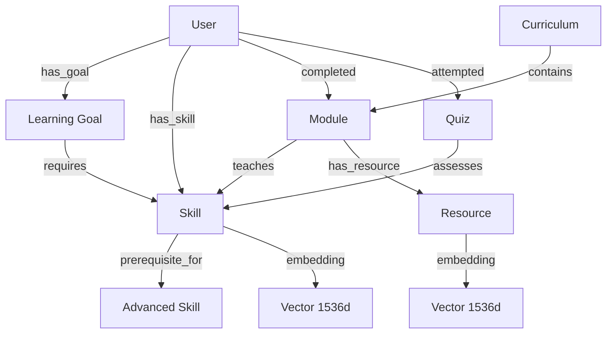
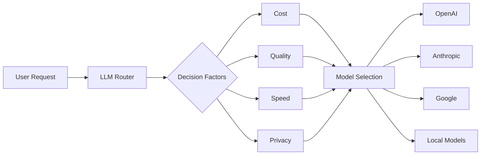
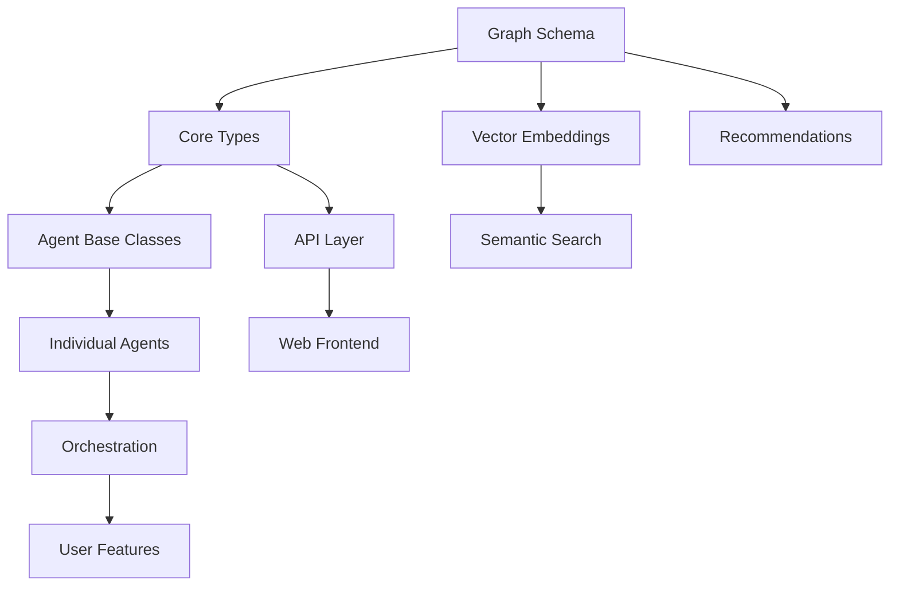

# PER-LERP Strategic Planning Document

## Table of Contents

1. [Executive Summary](#executive-summary)
2. [Technical Architecture Decisions](#technical-architecture-decisions)
3. [Development Roadmap](#development-roadmap)
4. [Success Metrics & KPIs](#success-metrics--kpis)
5. [Infrastructure & Scaling](#infrastructure--scaling)
6. [Dependencies & Blockers](#dependencies--blockers)
7. [Decision Log](#decision-log)

## Executive Summary

### Project Vision
PER-LERP (Personalized Learning-Path Generator) aims to revolutionize online education by creating truly personalized learning experiences through AI agent orchestration. Unlike traditional e-learning platforms, PER-LERP dynamically adapts to each learner's progress, preferences, and goals in real-time. The platform is built with modern technologies including Next.js, ShadCN/UI, and a graph database for optimal performance and user experience.

### Key Differentiators
- **Multi-Agent Architecture**: Specialized AI agents collaborate via Google's A2A protocol
- **Multi-LLM Support**: Users can choose and configure their preferred AI models
- **Git Integration**: Learners own their learning journey through personal repositories
- **Dynamic Adaptation**: Real-time curriculum adjustments based on performance
- **Cost Transparency**: Clear visibility into AI usage and costs

### Target Launch: June 1, 2025 (Public Beta)

## Technical Architecture Decisions

### Core Technology Stack

| Component | Technology | Rationale |
|-----------|------------|-----------|
| **Orchestration** | PocketFlow | Lightweight, flexible agent orchestration |
| **Agent Communication** | Google A2A Protocol | Industry standard, scalable, secure |
| **Backend Runtime** | Node.js + TypeScript | Type safety, ecosystem, team expertise |
| **Web Framework** | Next.js 14 | SSR, performance, developer experience |
| **UI Components** | ShadCN/UI | Accessible, customizable, well-designed |
| **API Layer** | Express + GraphQL | Flexibility for complex queries |
| **Primary Database** | PostgreSQL + Apache AGE | Graph capabilities with ACID compliance |
| **Vector Search** | pg_vector | Semantic search within same database |
| **Cache** | Redis | Session management, real-time features |
| **Message Queue** | RabbitMQ | Agent communication, task queuing |

### Graph Database Architecture

#### PostgreSQL with Graph Extensions

```sql
-- Using Apache AGE for graph capabilities
CREATE EXTENSION IF NOT EXISTS age;
CREATE EXTENSION IF NOT EXISTS vector;

-- Create graph schema
SELECT create_graph('learning_graph');

-- Example: Knowledge graph structure
SELECT * FROM cypher('learning_graph', $$
    CREATE (python:Skill {name: 'Python', level: 'beginner'}),
           (numpy:Skill {name: 'NumPy', level: 'intermediate'}),
           (pandas:Skill {name: 'Pandas', level: 'intermediate'}),
           (ml:Skill {name: 'Machine Learning', level: 'advanced'}),
           (python)-[:PREREQUISITE_FOR]->(numpy),
           (python)-[:PREREQUISITE_FOR]->(pandas),
           (numpy)-[:PREREQUISITE_FOR]->(ml),
           (pandas)-[:PREREQUISITE_FOR]->(ml)
$$) as (result agtype);
```

#### Alternative: Memgraph Evaluation

| Aspect | PostgreSQL + AGE | Memgraph |
|--------|------------------|----------|
| **Performance** | Good for mixed workloads | Excellent for pure graph |
| **Ecosystem** | Extensive PostgreSQL tools | Growing, specialized |
| **Learning Curve** | Familiar SQL + Cypher | Pure Cypher |
| **Vector Support** | Native with pg_vector | Requires integration |
| **Operational** | Single database | Additional service |

**Decision**: Start with PostgreSQL + Apache AGE + pg_vector for unified data layer, evaluate Memgraph if graph performance becomes bottleneck.

### Architectural Principles

1. **Microservices with Monorepo**
   - Each agent as independent service
   - Shared code through packages
   - Independent deployment capability

2. **Event-Driven Architecture**
   - Agents communicate asynchronously
   - Event sourcing for audit trail
   - CQRS for read/write optimization

3. **API-First Design**
   - All functionality exposed via APIs
   - Mobile-ready from day one
   - Third-party integration capability

4. **Privacy by Design**
   - Local LLM options
   - Data minimization
   - User-controlled data export

### Knowledge Graph Schema



### Multi-LLM Strategy



## Development Roadmap

### Phase 1: MVP (Feb 1 - Mar 14, 2025)
**Goal**: Core functionality with basic agent orchestration

#### Week 1-2: Foundation
- [ ] Project setup and CI/CD pipeline
- [ ] PostgreSQL + Apache AGE setup
- [ ] Graph schema design and implementation
- [ ] Core type definitions and interfaces
- [ ] Basic authentication system

#### Week 3-4: Core Agents & Graph Integration
- [ ] Goal-Setter Agent implementation
- [ ] Knowledge-Assessor Agent with graph queries
- [ ] Skill graph construction
- [ ] Basic PocketFlow orchestration
- [ ] Agent communication framework

#### Week 5-6: Curriculum & Resources
- [ ] Curriculum-Generator using graph traversal
- [ ] Resource-Finder with vector search
- [ ] Learning path optimization algorithms
- [ ] Basic web UI with ShadCN components (dashboard, goal creation)
- [ ] API endpoints for core functionality

**Deliverables**: Working MVP with goal setting and curriculum generation using graph-based recommendations

### Phase 2: Beta Features (Mar 15 - Apr 30, 2025)
**Goal**: Full A2A integration and advanced features

#### Week 7-8: A2A Protocol Integration
- [ ] Implement A2A protocol handler
- [ ] Agent service discovery
- [ ] Inter-agent secure communication
- [ ] A2A monitoring and debugging tools

#### Week 9-10: Multi-LLM & Prompt Management
- [ ] LLM router implementation
- [ ] Model selection algorithm
- [ ] Prompt template system with embeddings
- [ ] Cost tracking and optimization
- [ ] User preference management

#### Week 11-12: Advanced Features
- [ ] Git repository integration
- [ ] Progress tracking in graph
- [ ] Quiz generation from knowledge graph
- [ ] AI Mentor with context awareness
- [ ] Real-time WebSocket updates

**Deliverables**: Feature-complete beta with all agents operational and graph-powered recommendations

### Phase 3: Production Ready (May 1 - May 31, 2025)
**Goal**: Performance, security, and launch preparation

#### Week 13-14: Optimization
- [ ] Graph query optimization
- [ ] Vector search performance tuning
- [ ] Caching strategy for graph traversals
- [ ] Database query optimization
- [ ] Load testing and scaling

#### Week 15-16: Security & Polish
- [ ] Security audit and fixes
- [ ] Penetration testing
- [ ] UI/UX refinements with ShadCN theming
- [ ] Documentation completion
- [ ] Beta user onboarding

**Deliverables**: Production-ready platform

### Phase 4: Post-Launch (June 1, 2025+)
- Mobile app development
- Advanced graph analytics
- Community-contributed learning paths
- Enterprise features
- International expansion

## Success Metrics & KPIs

### Technical Metrics

| Metric | Target | Measurement |
|--------|--------|-------------|
| **API Response Time** | < 200ms p95 | APM monitoring |
| **Graph Query Time** | < 100ms p95 | Database metrics |
| **Vector Search Time** | < 50ms p95 | pg_vector metrics |
| **Agent Response Time** | < 2s p95 | Custom metrics |
| **System Uptime** | 99.9% | Uptime monitoring |
| **Error Rate** | < 0.1% | Error tracking |
| **Test Coverage** | > 80% | CI/CD reports |

### Business Metrics

| Metric | 3 Months | 6 Months | 12 Months |
|--------|----------|----------|-----------|
| **Registered Users** | 1,000 | 10,000 | 50,000 |
| **Active Users (MAU)** | 600 | 6,000 | 30,000 |
| **Paid Conversions** | 10% | 15% | 20% |
| **MRR** | $5,000 | $60,000 | $300,000 |
| **User Retention** | 60% | 70% | 80% |
| **NPS Score** | 40 | 50 | 60 |

### Learning Metrics

| Metric | Target | Importance |
|--------|--------|------------|
| **Goal Completion Rate** | 65% | Critical |
| **Weekly Learning Hours** | 5+ hours | High |
| **Resource Engagement** | 80% | High |
| **Knowledge Retention** | 75% | Critical |
| **Git Repo Adoption** | 40% | Medium |
| **Learning Path Efficiency** | 85% | High |
| **UI Engagement Rate** | 70% | High |

### Graph Database Metrics

| Metric | Target | Purpose |
|--------|--------|---------|
| **Graph Traversal Speed** | < 50ms | Path finding |
| **Relationship Queries** | < 30ms | Recommendations |
| **Vector Similarity Search** | < 40ms | Content matching |
| **Graph Update Time** | < 100ms | Real-time updates |

## Infrastructure & Scaling

### Architecture Evolution

#### Phase 1: Unified Database
```
┌─────────────────┐
│   Web Server    │
│   API Server    │
│   All Agents    │
└────────┬────────┘
         │
    ┌────┴────────────┐
    │  PostgreSQL     │
    │  + Apache AGE   │
    │  + pg_vector    │
    └─────────────────┘
```

#### Phase 2: Service Separation
```
┌─────────┐ ┌─────────┐ ┌─────────┐
│   Web   │ │   API   │ │ Agents  │
└────┬────┘ └────┬────┘ └────┬────┘
     └───────────┼───────────┘
                 │
         ┌───────┴────────┐
         │ Message Queue  │
         └───────┬────────┘
                 │
         ┌───────┴────────────┐
         │  PostgreSQL +      │
         │  Graph Extensions  │
         └────────────────────┘
```

#### Phase 3: Scaled Architecture
```
┌─────────────────────┐ ┌─────────┐ ┌─────────┐ ┌─────────┐
│ Web (Next.js +      │ │   API   │ │Agent-1  │ │Agent-N  │
│ ShadCN/UI)          │ │         │ │         │ │         │
└────────┬────────────┘ └────┬────┘ └────┬────┘ └────┬────┘
         └───────────────────┼────────────┼────────────┘
                             │            │
                     ┌───────┴────────┐   │
                     │  API Gateway   │   │
                     └───────┬────────┘   │
                             │            │
                     ┌───────┴────────────┴───┐
                     │   Service Mesh (A2A)   │
                     └───────┬────────────────┘
                             │
                     ┌───────┴─────────────────┐
                     │   Data Layer            │
                     │ ┌─────────────────────┐ │
                     │ │  PostgreSQL Master  │ │
                     │ │  + Graph + Vector   │ │
                     │ └──────────┬──────────┘ │
                     │            │            │
                     │ ┌──────────┴─────────┐ │
                     │ │   Read Replicas    │ │
                     │ └────────────────────┘ │
                     └─────────────────────────┘
```

### Graph Database Scaling Strategy

| Stage | User Count | Strategy |
|-------|------------|----------|
| **MVP** | < 1k | Single PostgreSQL instance |
| **Growth** | 1k-10k | Read replicas, query optimization |
| **Scale** | 10k-50k | Graph partitioning by domain |
| **Enterprise** | 50k+ | Consider dedicated graph DB |

### Scaling Triggers

| Metric | Threshold | Action |
|--------|-----------|--------|
| **API Response Time** | > 500ms p95 | Add API servers |
| **Graph Query Time** | > 200ms p95 | Optimize queries, add indices |
| **Database CPU** | > 70% | Add read replicas |
| **Active Users** | > 10k | Evaluate graph partitioning |
| **Vector Search Time** | > 100ms | Tune pg_vector settings |

### Disaster Recovery

1. **Backup Strategy**
   - Database: Continuous replication + daily snapshots
   - Graph data: Incremental graph backups
   - Embeddings: Weekly full backup (stable data)
   - User data: Real-time replication to Git

2. **Recovery Targets**
   - RPO (Recovery Point Objective): 1 hour
   - RTO (Recovery Time Objective): 4 hours
   - Graph consistency verification post-recovery
   - Embedding index rebuild if needed

## Dependencies & Blockers

### External Dependencies

| Dependency | Critical | Mitigation | Status |
|------------|----------|------------|--------|
| **OpenAI API** | Yes | Multiple LLM providers | ✅ Mitigated |
| **GitHub API** | No | GitLab as alternative | ✅ Mitigated |
| **Google A2A Protocol** | Yes | Build compatibility layer | ⚠️  Monitor |
| **Apache AGE** | Yes | Memgraph as fallback | ⚠️  Monitor |
| **pg_vector** | Yes | External vector DB option | ✅ Stable |

### Internal Dependencies



### Potential Blockers

1. **Graph Performance at Scale**
   - Risk: Complex traversals slow down
   - Mitigation: Query optimization, caching
   - Fallback: Dedicated graph database

2. **Vector Search Scaling**
   - Risk: Embedding search becomes slow
   - Mitigation: Index optimization, partitioning
   - Fallback: Dedicated vector database

3. **A2A Protocol Documentation**
   - Risk: Incomplete or changing spec
   - Mitigation: Build abstraction layer
   - Owner: Tech Lead

## Decision Log

### Architectural Decisions

| Date | Decision | Rationale | Alternatives Considered |
|------|----------|-----------|-------------------------|
| 2025-01-15 | Monorepo with pnpm | Code sharing, atomic commits | Polyrepo, Lerna, Nx |
| 2025-01-16 | Node.js + TypeScript | Type safety, ecosystem | Python, Go, Rust |
| 2025-01-17 | PostgreSQL + Apache AGE | Unified graph/relational/vector | Neo4j, Memgraph, ArangoDB |
| 2025-01-18 | pg_vector for embeddings | Same database, good performance | Pinecone, Weaviate, Qdrant |
| 2025-01-19 | PocketFlow orchestration | Lightweight, flexible | Temporal, Camunda |
| 2025-01-20 | A2A Protocol | Industry standard | Custom protocol, gRPC |
| 2025-01-21 | Multi-LLM strategy | Flexibility, cost control | Single provider |
| 2025-01-22 | ShadCN/UI + Tailwind | Accessibility, customization, modern design | Material UI, Ant Design, Chakra |

### Technology Choices

| Component | Choice | Rationale |
|-----------|--------|-----------|
| **Web Framework** | Next.js 14 | Performance, DX, SSR |
| **UI Components** | ShadCN/UI | Accessibility, customization, TypeScript |
| **CSS Framework** | Tailwind CSS | Flexibility, performance, ShadCN base |
| **State Management** | Zustand | Simplicity, TypeScript |
| **API Style** | REST + GraphQL | Flexibility, graph queries |
| **Testing** | Jest + Playwright | Comprehensive coverage |
| **Monitoring** | Prometheus + Grafana | Open source, powerful |

### Process Decisions

| Area | Decision | Rationale |
|------|----------|-----------|
| **Git Flow** | GitHub Flow | Simplicity, CI/CD friendly |
| **Code Review** | Required for all PRs | Quality, knowledge sharing |
| **Deployment** | Blue-green deployment | Zero downtime |
| **Documentation** | Docs as code | Version control, review |
| **Communication** | Async-first | Remote team support |

## Next Steps

### Immediate Actions (Week 1)

1. **Infrastructure Setup**
   - [ ] PostgreSQL with Apache AGE installation
   - [ ] pg_vector extension setup
   - [ ] Graph schema design
   - [ ] Development environment
   - [ ] ShadCN/UI component setup

2. **Technical Foundation**
   - [ ] Graph data model implementation
   - [ ] Vector embedding pipeline
   - [ ] Basic graph queries
   - [ ] API architecture
   - [ ] UI component library configuration

3. **Project Initialization**
   - [ ] Repository creation
   - [ ] CI/CD pipeline
   - [ ] Documentation structure
   - [ ] Testing framework
   - [ ] Design system setup

### Week 2-4 Priorities

1. **Graph Development**
   - Knowledge graph construction
   - Learning path algorithms
   - Recommendation engine
   - Vector search integration
   - Graph visualization components

2. **Agent Framework**
   - Base agent with graph access
   - A2A protocol preparation
   - Agent communication patterns
   - Error handling

3. **Early Validation**
   - Graph query performance tests
   - Vector search benchmarks
   - Scalability assessment
   - Architecture validation
   - UI component testing

## Success Criteria for Planning

- [ ] Graph database schema is designed and validated
- [ ] Vector search integration is tested
- [ ] Technical architecture supports graph operations
- [ ] Development environment includes graph tools
- [ ] ShadCN/UI component library is configured with custom theme
- [ ] First sprint includes graph implementation tasks
- [ ] Performance benchmarks are established
- [ ] Scaling strategy for graph data is defined
- [ ] Team understands graph database concepts

---

**Document Version**: 1.4
**Last Updated**: January 2025
**Owner**: PER-LERP Technical Team
**Review Cycle**: Bi-weekly during development, monthly post-launch
**Changes**: Added ShadCN/UI throughout technical stack and development plan